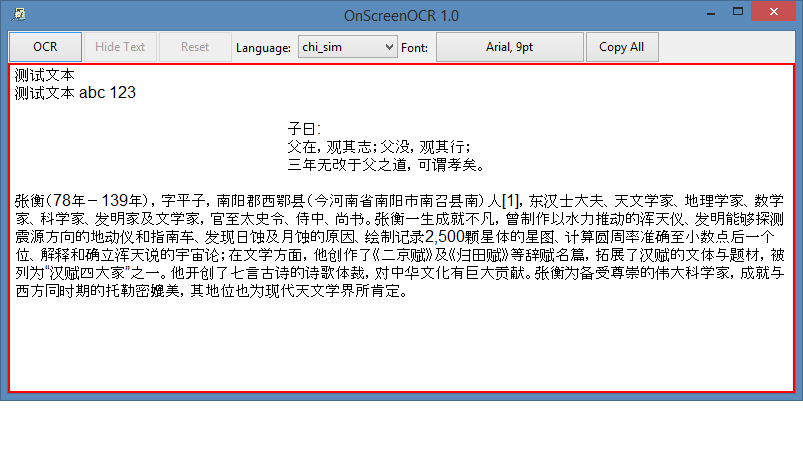
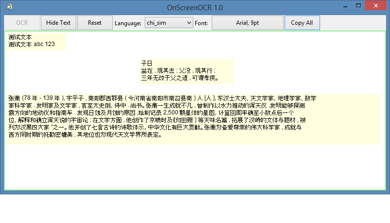

# OnScreenOCR

An OCR software that capture a part of your screen and extract text from it.

## How to use

First, create a folder named tessdata near OnScreenOCR.exe, download trained data from https://github.com/tesseract-ocr/tessdata_best according to the language you want to extract, and put the trained data into tessdata folder.

Then open OnScreenOCR.exe, move and resize the window to match a part of your screen:

Now click OCR button, you can see text extracted from screen and pinned to the original position:

You can copy text from the specified block or click Copy All button to copy all text.

Finally, you can click Reset button to prepare for next OCR operation.

## License

MIT License
Copyright © 2019 dudes-come
If you have any license issue please contact dudes@qq.com.